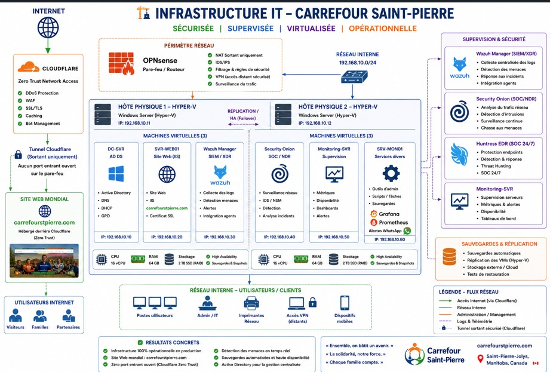
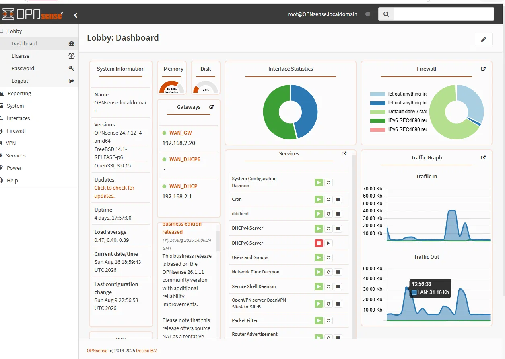
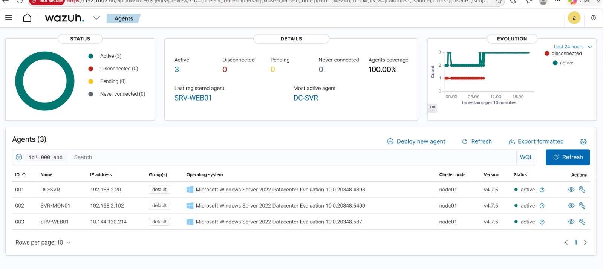
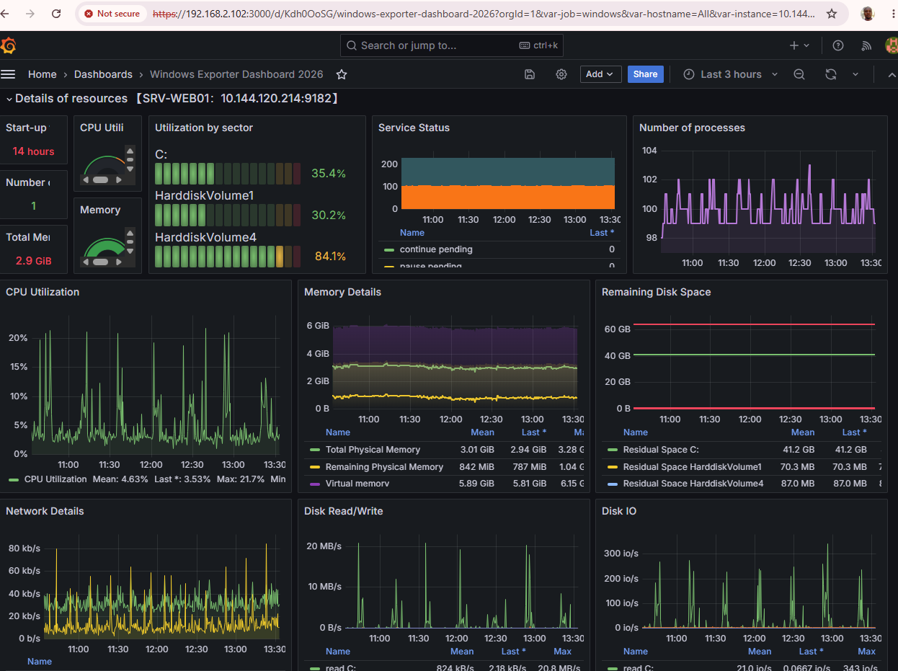

# 🛡️ Homelab SOC — Infrastructure IT sécurisée, supervisée et virtualisée

Architecture réseau et sécurité déployée et opérée en environnement de laboratoire personnel, reproduisant les pratiques d'une infrastructure IT de PME : pare-feu périmétrique, virtualisation haute disponibilité, SOC (SIEM/XDR/NDR/EDR) et supervision temps réel.


---

## 📐 Vue d'ensemble de l'architecture



L'infrastructure repose sur deux hôtes physiques Hyper-V en haute disponibilité, un périmètre réseau protégé par OPNsense, un accès web public sécurisé via Cloudflare Zero Trust, et une pile de sécurité complète (SIEM, NDR, EDR) supervisée en temps réel.

**Résultats concrets :**
- ✅ Infrastructure 100 % opérationnelle en production
- ✅ Site web public : hébergé derrière Cloudflare Zero Trust, zéro port entrant ouvert
- ✅ Détection des menaces en temps réel (SIEM/XDR + EDR)
- ✅ Sauvegardes automatisées et haute disponibilité (réplication Hyper-V)
- ✅ Active Directory pour la gestion centralisée des identités

---

## 🧱 Stack technique

### Virtualisation
- **Microsoft Hyper-V** — hyperviseur principal sur deux hôtes physiques (`DESKTOP-J7H10AF`, `PC-DADDY`)
- **Hyper-V Virtual Switch** — réseaux internes/externes dédiés (`LAN-OPNsense`, `SOC-Internal`, `vSwitch-LAB`, etc.)

### Pare-feu / Routage
- **OPNsense** (v24.7.12_4) sur **FreeBSD 14.1** — pare-feu périmétrique, NAT, filtrage, VPN
- **pf (Packet Filter)** — moteur de filtrage natif
- **Unbound DNS** — résolveur DNS récursif
- **DHCP (ISC/Kea)** — attribution automatique d'adresses IP

### VPN & accès distant
- **OpenVPN** — site-to-site + road warrior (PKI/TLS)
- **WireGuard** — accès mobile léger

### Sécurité — SIEM / XDR / NDR / EDR
- **Wazuh** (v4.7.5) + **OpenSearch** — SIEM/XDR open-source
- **Security Onion** — NSM (Suricata, Zeek, Elasticsearch)
- **Huntress** — EDR cloud-managé
- **Darktrace** — point de capture réseau (mirroring)

### Monitoring / Observabilité
- **Prometheus** (v2.51.0) + **node_exporter** / **windows_exporter**
- **Grafana** — dashboards temps réel

### PKI & DNS
- **OpenSSL** + CA interne (`VPN-CA`)
- **Cloudflare + ddclient** — DNS dynamique

### Systèmes d'exploitation
- Windows Server 2022 (`DC-SVR`, `SRV-WEB01`, `SVR-MON01`)
- Windows 11 (postes clients)
- Ubuntu 22.04 LTS (Wazuh Manager)

Inventaire technique complet : [`technologies-labo.md`](./technologies-labo.md)

---

## 🗺️ Schéma d'architecture simplifié

```text
Internet
   │
   ▼
[OPNsense] (FreeBSD, pf, Unbound, DHCP, NAT, VPN)
   │
   ├── LAN 192.168.1.0/24 ── SRV-WEB01 (Windows Server 2022 + Huntress + windows_exporter)
   │
   └── LAN 192.168.2.0/24 ── DC-SVR, SVR-MON01, Wazuh-Manager (Ubuntu), Security Onion
                                    │
                                    └── Wazuh Indexer/Dashboard (OpenSearch)

VPN distant ── OpenVPN / WireGuard ── accès mobile au LAN
DNS dynamique ── ddclient → Cloudflare (vpn.daddyconnectit.com)
Monitoring ── Prometheus + exporters → Grafana
```

---
## 📊 Captures d'écran

**Pare-feu OPNsense — tableau de bord**



**Wazuh — agents SIEM actifs (100 % de couverture)**



**Monitoring Grafana — supervision serveur (vue d'ensemble)**



**Monitoring Grafana — métriques détaillées (réseau, disque, exceptions système)**


## 🎯 Objectif du projet

Ce lab a été conçu pour reproduire, en conditions réelles, les défis d'une infrastructure IT de PME : sécurité périmétrique, haute disponibilité, détection de menaces, supervision continue et bonnes pratiques de sauvegarde — dans le but de développer et démontrer des compétences directement applicables en administration réseau, cybersécurité (SOC) et infrastructure cloud/virtualisée.

## 👤 À propos

Architecte de solutions multi-cloud avec plus de 10 ans d'expérience en technologie, depuis mes débuts en 2014 dans la digitalisation chez **FabricaInfo** (Fortaleza, Brésil). Diplômé EDE en télécommunications-électronique, avec 8+ ans d'expérience combinée en télécommunications et en électromécanique.

**Expérience professionnelle :**

**Architecte de solutions** — Mytech APN (AWS), 2022–2024

**Technicien Support IT Niveau II/III — Déploiement infrastructure réseau**
Missions terrain via WorkMarket (AVASO) pour Air Canada et clients GSB à travers le Québec :
- Installation et configuration Citrix pour accès distant
- Déploiement et configuration Intune (Company Portal, gestion d'appareils mobiles)
- Configuration d'imprimantes Epson pour systèmes de billetterie
- Installation physique (rack & stack) de pare-feu Fortinet FortiGate et commutateurs Cisco Catalyst 9300 PoE+
- Déploiement de solutions de détection réseau (DarkTrace)
- Câblage structuré et configuration via console Cisco

**Certifications :**
- AWS Certified Solutions Architect – Associate
- Microsoft Certified: Azure Administrator Associate (AZ-104)
- AWS Certified Cloud Practitioner

Ce laboratoire personnel illustre ma spécialisation continue vers l'infrastructure IT et la cybersécurité, en complément de mon expertise en architecture cloud multi-plateforme et de mon expérience terrain en déploiement réseau.
